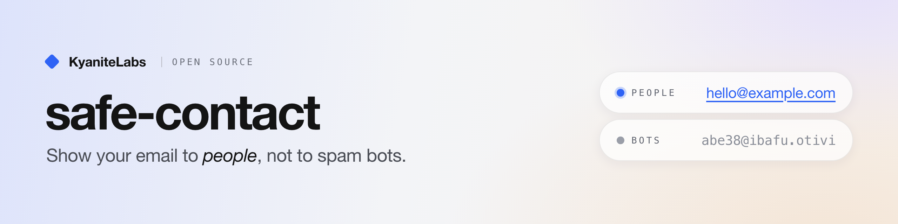

<picture>
  <source media="(prefers-color-scheme: dark)" srcset=".github/banner-dark.png">
  
</picture>

# safe-contact

Show your email address and phone number to people, not to spam bots.

Bots scrape web pages for addresses and sell them to spammers. `safe-contact` keeps the address out of your page until a person points at it, focuses it or taps it. In its place the page holds a made-up address that cannot be delivered, so a bot that takes it gets junk. The link looks and works like a normal link, and one click opens the mail app.

**[Live demo](https://kyanitehq.github.io/safe-contact/)** · 0.6 KB browser script · no CSS · works with a strict Content Security Policy · React, plain HTML or a CLI

```html
<!-- What bots see, in the HTML and in the page after scripts run: a made-up address -->
<a href="#" data-safe-contact="bW9jLmV0aXNy…" aria-label="Email address, activate to show"><span aria-hidden="true">uho@puweher.mifi</span></a>

<!-- What people see after they hover, focus or tap it: -->
<a href="mailto:you@yoursite.com">you@yoursite.com</a>
```

## Pick your setup

| Your site | Use | Address reaches the browser? |
|---|---|---|
| React with server components (Next.js App Router, or another React Server Components framework) | [`<Email>`, `<Phone>`, `<Sms>`](#react-with-server-components) | No |
| React, client-only (Vite, CRA) or data passed as props from the server (Next.js Pages Router, Remix loaders) | [`<SafeContact data>`](#react-client-side) | No |
| Any HTML page (static site, WordPress, Webflow, hand-written HTML) | [The CLI and a script tag](#any-html-page) | No |
| HTML built on a server or at build time (Astro, Eleventy, Express, SvelteKit, Vue SSR) | [`render()` and a script tag](#html-built-by-your-code) | No |

## Install

```sh
npm install safe-contact
```

## React with server components

Use `<Email>`, `<Phone>` and `<Sms>` in a **server component** (a file without `"use client"`). They scramble the address on the server; only the scrambled value is sent to the browser.

```tsx
import { Email, Phone, Sms } from "safe-contact/react";

export default function ContactPage() {
  return (
    <p>
      Write to <Email address="you@yoursite.com" />,
      call <Phone number="+1 555 0100" />,
      or <Sms number="+1 555 0100" body="Hi!">send a text</Sms>.
      <Email address="you@yoursite.com" subject="Hello" className="button">Email us</Email>
    </p>
  );
}
```

Nothing else to set up: no provider, no script tag, no CSS.

## React, client-side

If the component runs in the browser (a `"use client"` file, a Vite app, or a Next.js Pages Router page), an address written in the code or passed as a prop ends up in your JavaScript or in the page's JSON. Pass a scrambled value instead.

Scramble once, on your machine:

```sh
npx safe-contact you@yoursite.com --data
# bW9jLmV0aXNydW95QHVveTpvdGxpYW0KbW9jLmV0aXNydW95QHVveQ==
```

```tsx
import { SafeContact } from "safe-contact/react";

<SafeContact data="bW9jLmV0aXNydW95QHVveTpvdGxpYW0KbW9jLmV0aXNydW95QHVveQ==" />
<SafeContact data="bW9jLmV0aXNydW95…">Email us</SafeContact>
```

Or scramble on the server and pass the result as a prop (for example in `getStaticProps` or a loader):

```ts
import { encode, mailto } from "safe-contact";

export function getStaticProps() {
  return { props: { contact: encode(mailto("you@yoursite.com")) } }; // never the plain address
}
```

## Any HTML page

Print the HTML for your link:

```sh
npx safe-contact you@yoursite.com
npx safe-contact you@yoursite.com --label "Email us" --subject "Hello"
npx safe-contact "+1 555 0100"
npx safe-contact "+1 555 0100" --sms --body "Hi!"
```

Paste the printed `<a …>` where the link should go. Then add this once per page, anywhere:

```html
<script src="https://unpkg.com/safe-contact/dist/auto.js" defer></script>
```

## HTML built by your code

On the server or at build time, `render()` returns the same HTML the CLI prints:

```js
import { render, mailto, tel, sms } from "safe-contact";

render(mailto("you@yoursite.com"));
render(mailto("you@yoursite.com", { subject: "Hello" }), { label: "Email us" });
render(tel("+1 555 0100"));
render(sms("+1 555 0100", "Hi!"));
```

Insert the string as raw HTML (it is already escaped), and load the browser part once per page: the script tag above, or `import "safe-contact/auto";` in your client bundle.

## Rules that keep the address hidden

These matter more than which setup you pick. They are the usual mistakes:

1. **Write the plain address only in server-side code.** Not in a `"use client"` file, not in props that are sent to the browser, not in `getStaticProps` or loader data, not in client-side environment variables.
2. **Don't leave it anywhere else on the page.** Check the `<title>`, meta tags, JSON-LD (`"email": …`), `alt` text, footer, and `mailto:` links elsewhere. One plain copy defeats the rest.
3. **Load the browser part once per page when you use `render()` or the CLI.** Without it the links never reveal: they show the address, but clicking only jumps to the top of the page. React components need no script.
4. **In React, use the components, not the printed HTML.** `<SafeContact data>` gives the same result and handles the reveal inside React.

## How it works

1. The page holds a decoy in place of the address: a made-up user name, domain and top-level domain (`uho@puweher.mifi`) that reads like an address but cannot be delivered. For a phone number it is random digits after `+0`, a country code that does not exist. A bot that harvests the page gets junk; nothing in the page gives the real address away.
2. The real link is scrambled in the `data-safe-contact` attribute (the address and link, reversed, then base64). The `href` is `#`, so there's no `mailto:` link to find, yet browsers and your CSS treat it as a normal link.
3. When someone hovers, focuses, taps or clicks, the decoy becomes the real address and the link a real `mailto:`, `tel:` or `sms:` link, just before the click lands. Copying the text copies the real address.

The decoy is derived from the address, so the same address always gets the same decoy (server and client render alike, builds stay reproducible), and it is as long as the real text, so nothing moves on reveal. Until someone reaches for the link they see the decoy, so people who only read, print or screenshot the page do not see the address.

**Accessibility.** Screen readers hear "Email address, activate to show" or "Phone number, activate to show" (set your own with `hint`, e.g. for other languages). Keyboard users can tab to the link; focusing it reveals it.

**Styling.** Hidden and revealed links are both `<a href>`, so your link styles apply to both. Target hidden ones with `a[data-safe-contact]`.

**Without JavaScript** the decoy stays, and clicking it only jumps to the top of the page.

**Limits.** No trick stops a bot built to beat it. Most harvesters read raw HTML; some run the page in a headless browser; very few hover over every link. This stops all but the last kind, and the first two kinds take home a decoy. It hides addresses from harvesters. It does not filter spam or hide an address that is already public elsewhere.

## API

### `safe-contact/react`

```ts
<Email address: string subject?: string body?: string cc?: string | string[] bcc?: string | string[] {...LinkProps} />
<Phone number: string {...LinkProps} />
<Sms number: string body?: string {...LinkProps} />
<SafeContact data: string {...LinkProps} />   // data from encode() or `npx safe-contact <address> --data`

LinkProps = every <a> prop except href, plus:
  children?: ReactNode   // shown instead of the address, e.g. "Email us"
  hint?: string          // what screen readers hear before the reveal
```

`<Email>`, `<Phone>` and `<Sms>` throw a `TypeError` for an invalid address or number. `<SafeContact>` throws one for a `data` value that did not come from `encode()`.

### `safe-contact`

```ts
mailto(address: string, fields?: { subject?, body?, cc?, bcc? }): Contact   // throws TypeError if not an address
tel(number: string): Contact                                              // throws TypeError if under 3 digits
sms(number: string, body?: string): Contact

render(contact: Contact, options?: { label?: string; hint?: string; className?: string }): string
encode(contact: Contact): string             // the value for <SafeContact data> and data-safe-contact
decode(data: string): Contact | null         // null unless it is a mailto:, tel: or sms: contact

listen(document?: Document): void            // browser: reveal hidden links on hover, focus, press or click; safe to call twice
reveal(link: Element): string | null         // browser: reveal one link now; returns its real href

type Contact = { text: string; href: string } // text: what the link shows; href: the mailto:/tel:/sms: URL
```

### `safe-contact/auto`

The browser script: calls `listen()`. Use it as `<script src="https://unpkg.com/safe-contact/dist/auto.js" defer>` or `import "safe-contact/auto"`.

### CLI

```
npx safe-contact <email or phone number> [options]

  --label <text>    show this text instead of the address, e.g. "Email us"
  --subject <text>  email subject
  --body <text>     email body, or the message with --sms
  --sms             a text-message link instead of a call link (phone numbers only)
  --hint <text>     what screen readers hear before the reveal
  --class <names>   class names for the link
  --data            print only the scrambled value, for <SafeContact data>
```

A value containing `@` is treated as an email address; anything else as a phone number.

## Compatibility

Every current browser; tested in Chromium, Firefox and WebKit on every change. React 18 and 19. Node 18 or later for the CLI and `render()`.

## License

MIT © KyaniteHQ
